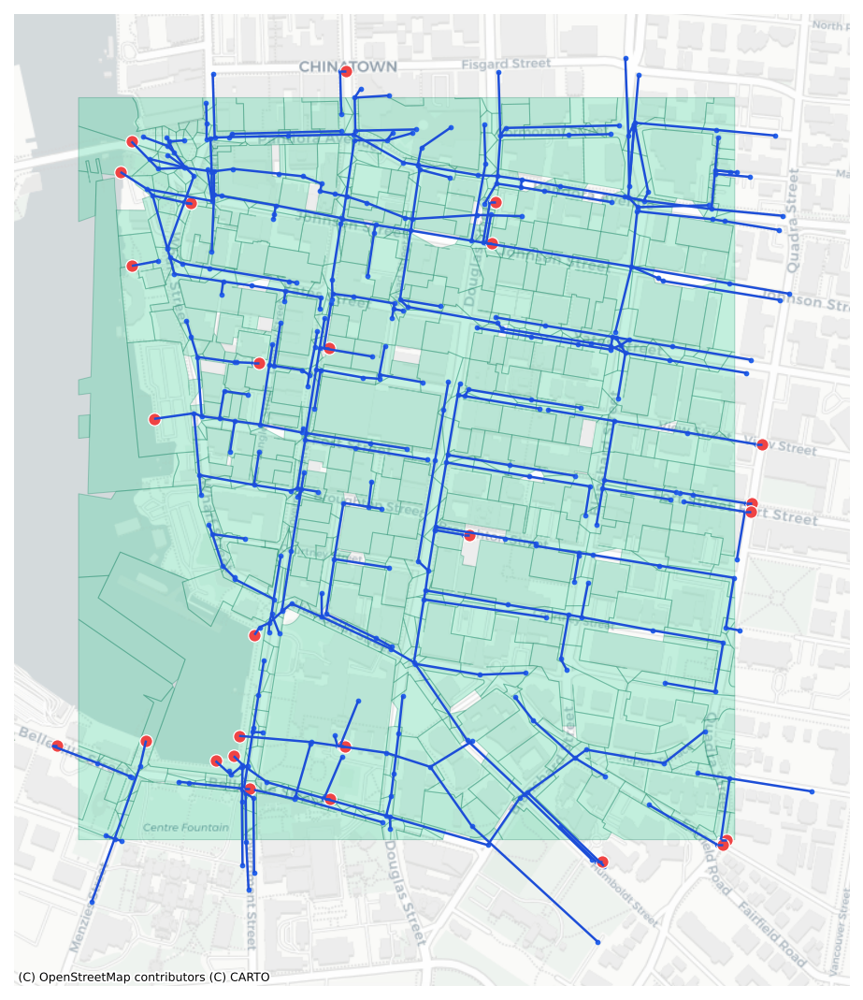

# SWMMCanada

> Draw an area in Canada → automatically assemble Canadian open data → a **runnable EPA SWMM model**.

- 🏙️ **Two modes, auto-selected by where you draw** — inside a city that publishes its storm network (Victoria, Ottawa) → ingest the **real** pipes; anywhere else in Canada → **synthesize** a network from open data.
- 🧩 **Parcel-shaped subcatchments** — where a city publishes parcels, cells follow real lot lines, not a generic grid.
- 🇨🇦 **100% Canadian open data** — terrain (NRCan), land cover (NALCMS), soil (SoilGrids), rainfall (ECCC), municipal storm networks (city ArcGIS); free / Open Government Licence.
- ✅ **Runnable EPA SWMM 5.2** — every model round-trips through swmm-api + swmmio and runs with 0 errors.
- 📦 **Shareable model-ready datastore** — GeoPackage + netCDF/CF + JSON, framework-independent.
- 🌐 **Web app** — draw or upload a boundary in a React + MapLibre UI, FastAPI backend, download the `.inp`.

## What it does

SWMMCanada turns a map polygon (or an uploaded boundary) into a complete, EPA-SWMM-valid
stormwater model: it fetches Canadian open data (terrain, land cover, soil, rainfall), derives
the subcatchment parameters, builds the drainage network, and writes a `model.inp` plus a
shareable **model-ready datastore**.

> **Status:** early development (WIP). Generated models run clean in EPA SWMM 5.2.

<p align="center">
  
</p>

<p align="center"><em>A model built from a downtown Victoria polygon: the city's <strong>real</strong> storm network (pipes &amp; junctions in blue, outfalls in red) with <strong>subcatchments shaped to real parcel lines</strong> (green), over the same Carto basemap the app uses.</em></p>

## Two ways to get a network

| Mode | How | Where | Fidelity |
|---|---|---|---|
| **Synthesize** | own street-graph + Voronoi synthesis from open data | anywhere in Canada | approximate |
| **Real municipal network** | ingest the city's published storm pipes (real inverts, diameters, topology) | cities that publish it | high |

Both paths then share the same downstream: derive parameters → ECCC rainfall → build `.inp` →
datastore. Supported real-network cities:

| City | Topology | Subcatchments | EPA SWMM result |
|---|---|---|---|
| Victoria, BC | explicit node IDs | catch-basin + parcel/building | 0 errors, continuity −0.05% |
| Ottawa, ON | inferred from geometry | catch-basin + land cover | 0 errors, flow routing −5% |

📊 **[Full validation, figures & EPA SWMM continuity → RESULTS.md](RESULTS.md)**

## Data sources (Canadian open data, free / Open Government Licence)

| Data | Source | Interface |
|---|---|---|
| Rainfall / temperature | ECCC GeoMet | `api.weather.gc.ca` (OGC, bbox) |
| DEM / elevation | NRCan MRDEM 30 m | AWS S3 COG (EPSG:3979) |
| Land cover → imperviousness | NRCan NALCMS 2020 | geo.ca STAC COG |
| Soil → HSG / curve number | ISRIC SoilGrids | WCS (auth-free) |
| Observed streamflow | ECCC HYDAT | SQLite |
| Municipal storm networks | City ArcGIS REST | per-city adapter (`sources/cities/`) |

## Output

- `model.inp` — EPA SWMM 5.2 model (junctions, conduits, outfalls, subcatchments, raingage)
- `datastore/` — the framework-independent hand-off: `network.gpkg` (GeoPackage) + `forcing.nc`
  (netCDF/CF) + `datastore.json` (config + provenance)
- `preview/network.geojson` (map layers), DEM/land-cover/soil rasters, `manifest.json`

## Project structure

```
backend/swmmcanada/
  geo/         AOI parsing, station selection, CRS
  acquire/     ECCC climate · NRCan DEM · NALCMS land cover · SoilGrids soil · HYDAT flow
  network/     own drainage-network synthesis + Voronoi subcatchments (open-data mode)
  derive/      clip + zonal stats → subcatchment parameters
  build/       assemble + validate the SWMM .inp
  datastore/   model-ready datastore (GeoPackage + netCDF + JSON)
  sources/     live data-source adapters
    cities/    base.py (shared assembler) + victoria.py + ottawa.py  ← real-network cities
  api/         FastAPI async tasks API
  pipeline.py  build_from_aoi · build_from_victoria · build_from_ottawa
frontend/      React 19 + Vite + MapLibre + Tailwind + Zustand
docs/          DESIGN.md, ADRs, module specs
```

## Quickstart

```bash
# backend (Python 3.11)
cd backend
python3.11 -m venv .venv && .venv/bin/pip install -e ".[dev]"
.venv/bin/uvicorn swmmcanada.api.main:app --port 8000

# frontend (proxies /api → :8000)
cd frontend && npm install && npm run dev
```

Build a model in code:

```python
from datetime import date
from swmmcanada.geo import aoi_from_geojson
from swmmcanada.pipeline import build_from_aoi, build_from_ottawa

aoi = aoi_from_geojson({"type": "Polygon", "coordinates": [...]})
build_from_aoi(aoi, date(2022, 6, 1), date(2022, 6, 7), "out/")        # synthesize anywhere
build_from_ottawa(aoi, date(2022, 6, 1), date(2022, 6, 7), "out_ott/")  # real Ottawa network
```

Adding a city ≈ one `sources/cities/<city>.py` (fetch + field mapping) + a one-line
`build_from_<city>` wrapper; the shared `cities/base.py` does the SWMM assembly.

## Requirements

- **Backend** — Python 3.11+; geopandas, shapely, pyproj, rasterio, networkx, swmm-api,
  swmmio, xarray, netcdf4, fastapi (full list in [`backend/pyproject.toml`](backend/pyproject.toml)).
- **Frontend** — Node 18+; React 19, Vite, MapLibre GL, Zustand, Tailwind
  (full list in [`frontend/package.json`](frontend/package.json)).
- A working **EPA SWMM 5** engine is only needed to *run* the generated `.inp`, not to build it.

## License

[MIT](LICENSE) © 2026 Zhonghao Zhang
