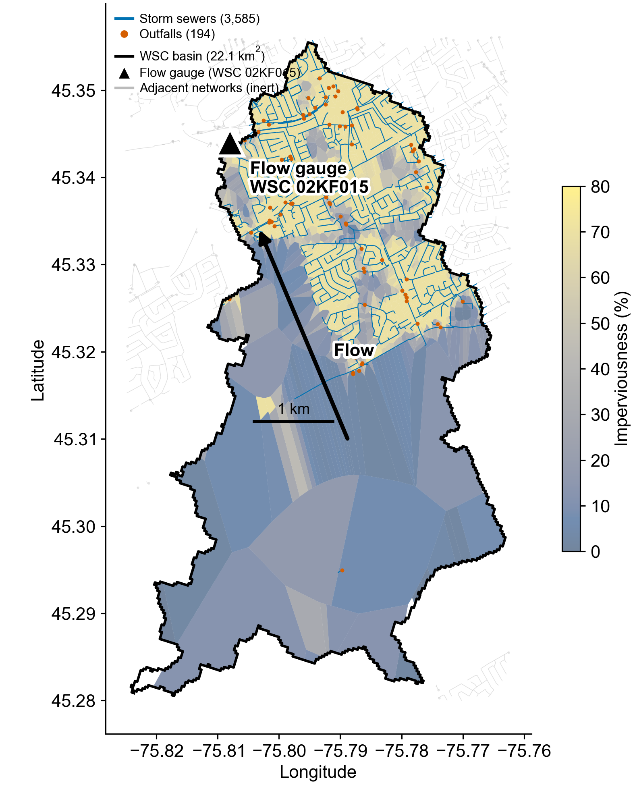
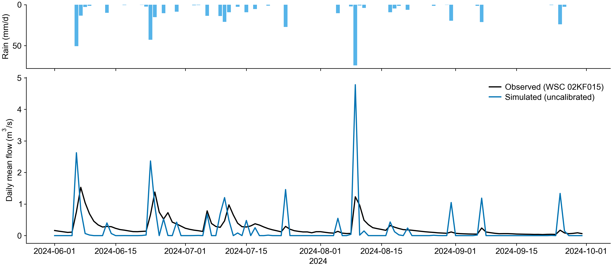

# Case study: Graham Creek, Ottawa — simulated vs observed flow

**One question:** if SWMMCanada builds a model with zero manual input and zero calibration,
how close does it get to a real flow gauge?

**One answer:** over the summer of 2024 it reproduced **all 12 rainfall events on the
correct days** with a total volume bias of **−22%**, and the remaining error decomposes
into two explainable structural gaps (no baseflow, no in-stream storage) rather than noise.

## Purpose

SWMMCanada turns a drawn polygon into a runnable EPA SWMM model from open data. Structural
validation (models build, run, and pass hydraulic checks in 35 cities) says nothing about
whether the *water volumes* are right. This case study is the first end-to-end comparison
against an independent observed record: a Water Survey of Canada stream gauge whose entire
drainage area fits inside one buildable model.

The model was **not calibrated**. Every parameter is what the pipeline derives
automatically from open data. That is the point: this measures the out-of-the-box baseline,
not a tuned showcase.

## Study area

Graham Creek at Nepean (Ottawa), WSC station **02KF015**: drainage area **22.09 km²**, a
continuous record since the 1990s. The area of interest is the **official WSC drainage
polygon** for the station — not a hand-drawn box — so the model drains exactly what the
gauge measures.



*The basin is half and half: the northern half is suburban Bells Corners
(imperviousness 60–80%, dense storm sewers — 3,585 municipal conduits, 3,550 manholes and
194 outfalls from Ottawa's open data), the southern half is National Capital Commission
greenbelt including the Stony Swamp wetlands (imperviousness near zero, no sewers).
The gauge (black triangle) sits at the northwest outlet. Grey lines are adjacent networks
captured by the bounding box; no subcatchments feed them, so they are inert. A mixed
urban-greenbelt basin is a harder test than a fully urban one — the model must get both
the fast city water and the slow greenbelt water right.*

## Data sources (all open)

| Data | Source |
|---|---|
| Storm sewers, manholes, outfalls | City of Ottawa open data (ArcGIS services) |
| Observed daily flow | ECCC **HYDAT** database, station 02KF015 |
| Basin polygon | ECCC/WSC National hydrometric network basin polygons |
| Rainfall and temperature | ECCC climate archive (hourly station rain, 448.5 mm over the window) |
| Terrain | NRCan MRDEM / HRDEM |
| Land cover, soils | NALCMS, SoilGrids/HYSOGs |

## Method

1. Feed the WSC basin polygon to the pipeline as the AOI; build the Ottawa model for
   2024-06-01 → 2024-09-30 (snow-free window). The build is one call, no manual edits;
   it completes with zero validation warnings.
2. Run EPA SWMM 5 (dynamic wave) over the 122-day window with observed rain.
3. Simulated basin discharge = the model's total outfall outflow, aggregated to daily
   means. Observed = HYDAT daily mean flow.
4. Compare: hydrograph, NSE, PBIAS, and a wet/dry-day decomposition.

## Results



*Top: daily rainfall (hanging bars). Bottom: daily mean flow — black is the gauge,
blue is the uncalibrated model. Every rain pulse has a same-day simulated response; the
simulated peaks are taller and narrower, and the simulated recessions drop to zero while
the observed ones decay slowly.*

| Metric | Value | Reading |
|---|---|---|
| Event detection | **12 / 12 events, same-day** | the rainfall→runoff→network→outflow chain is causally right |
| Volume bias (PBIAS) | **−22.3%** | correct order of magnitude with no tuning and no baseflow |
| Wet-day mean (34 d) | sim 0.696 vs obs 0.473 m³/s (**+47%**) | a sewer-network model has no in-stream or wetland storage; the real creek crosses the Stony Swamp wetlands, which attenuate every peak |
| Dry-day mean (88 d) | sim 0.001 vs obs 0.165 m³/s | the gap is groundwater baseflow, which a storm-runoff model deliberately does not simulate |
| Daily NSE | −2.49 | dominated by the two structural gaps above, not by random error |
| Monthly means (sim/obs) | Jun 0.28/0.42 · Jul 0.17/0.29 · Aug 0.24/0.22 · Sep 0.09/0.07 | August and September nearly coincide |

## Honest limitations

- **Uncalibrated by design** — no parameter was adjusted toward the gauge.
- **Daily against daily** — HYDAT publishes daily means; sub-daily peak shapes are not
  testable here.
- **Model scope** — simulated flow is *pipe-network outflow*; observed flow is *creek
  flow*. The creek channel, wetlands and any online storage are outside the model, which
  is the main reason wet days overshoot.
- **Zero baseflow is intentional** — the dry-day gap of 0.165 m³/s is consistent with it.
- One basin, one summer. Extending to more gauges (small active stations exist in
  Kingston, Windsor and Abbotsford) and to calibrated runs is future work.

## Reproduce

```bash
# 1. Get HYDAT (ECCC, ~270 MB zip) and note the sqlite path
#    https://collaboration.cmc.ec.gc.ca/cmc/hydrometrics/www/
# 2. Build + run + evaluate (backend venv, Python 3.11, EPA swmm5 on PATH):
cd results/graham-creek
../../backend/.venv/bin/python run_case.py --hydat /path/to/Hydat.sqlite3
```

`run_case.py` builds the model for the bundled WSC basin polygon, runs the engine
(~1–2 h for the 122-day window), and prints the metrics table.
